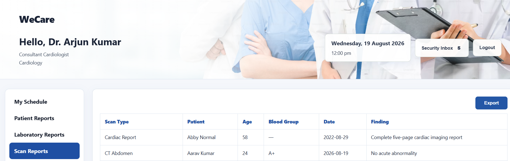

<h1 align="center"> WeCare</h1>

<p align="center">
  <strong>Intelligent Healthcare Data Protection through Behavioral AI, Zero Trust and Insider-Threat Detection</strong>
</p>

<p align="center">
  Healthcare Security • Behavioral Analytics • Zero Trust • Insider Threat Detection • Digital Evidence
</p>

---

# WeCare

> **Authentication gives access. Behavior determines trust.**

WeCare is a healthcare security and management platform designed to protect sensitive patient information from:

- Insider threats
- Abnormal user behavior
- Suspicious medical-record access
- Unauthorized data exports
- Low-and-slow data exfiltration
- Bulk patient-data extraction
- Unsafe privileged-user actions

Traditional systems mainly verify a user when they log in.

WeCare continues evaluating the user's actions **after authentication**.

The system continuously asks:

```text
WHO is performing the action?

WHAT are they trying to do?

DOES their behavior still deserve trust?
```

WeCare combines normal healthcare operations with:

```text
Behavior Monitoring
        +
Isolation Forest AI
        +
Zero Trust
        +
Risk Engine
        +
Real-Time Alerts
        +
Automated Response
        +
Evidence Preservation
```

---

#  What WeCare Does

WeCare provides normal hospital functionality while continuously monitoring sensitive activity.

Doctors can:

- View schedules
- Access patient reports
- Review laboratory reports
- View scan reports
- Access medical records
- Export approved records
- Receive security notifications

Administrators can:

- Manage doctors
- Manage patients
- Manage reception
- Manage laboratory data
- Manage pharmacy
- Access medical records
- Review export requests
- Monitor threats
- Review security notices
- Use the AI Security Operations Center
- Investigate Critical incidents

At the same time, WeCare analyzes user behavior to identify suspicious activity.

---

# Doctor Dashboard

The Doctor Dashboard provides access to clinical information while security monitoring operates in the background.

Available modules include:

```text
My Schedule
Patient Reports
Laboratory Reports
Scan Reports
Medical Records
Security Inbox
```

Doctors can perform normal hospital operations without manually interacting with the AI system.

The security engine monitors important activity automatically.

<p align="center">
  
</p>

---

# Scan Report Viewer

WeCare contains an integrated medical scan-report viewer.

The first report is a **Cardiac Report** containing five pages inside one vertically scrollable viewer.

```text
Scan Reports
│
├── Cardiac Report
│   ├── Page 1
│   ├── Page 2
│   ├── Page 3
│   ├── Page 4
│   └── Page 5
│
├── Existing Scan Record
├── Existing Scan Record
└── ...
```

This allows doctors to review detailed medical scans while remaining inside the protected WeCare environment.

---

# Admin Dashboard

The Admin Dashboard provides hospital-management functionality and security monitoring from one interface.

Main modules include:

```text
Dashboard
Doctors
Patients
Reception
Laboratory
Pharmacy
Medical Records
Export Requests
Threat Monitoring
Security Notices
AI Security Operations Center
Settings
```

The administrator can monitor:

- User activity
- Risk levels
- Export requests
- Critical incidents
- Doctor behavior
- Security alerts
- Evidence status
- Suspicious actions

---

# Authentication and Authorization

WeCare uses **JWT — JSON Web Tokens** for authenticated sessions.

After login:

```text
Username + Password
        ↓
Credential Verification
        ↓
JWT Generated
        ↓
User Role Identified
        ↓
Access Granted
```

Roles are used to control access to protected functionality.

Main roles include:

```text
Doctor
Admin
Evidence Officer
```

Passwords are stored securely using hashing through `bcryptjs`.

---

# Behavioral Security

A successfully authenticated user is not automatically trusted forever.

WeCare continuously evaluates behavior.

Examples of monitored signals include:

```text
Login Time
Session Duration
Records Viewed
Reports Downloaded
Departments Accessed
Failed Login Attempts
Unknown Device
External Network
After-Hours Activity
Export Volume
Export Frequency
Previous Export Activity
```

These signals are converted into features for security analysis.

---

# Isolation Forest AI

WeCare uses **Isolation Forest** for behavioral anomaly detection.

Isolation Forest is an unsupervised machine-learning algorithm that identifies behavior that differs significantly from normal activity.

The basic process is:

```text
User Activity
      ↓
Feature Extraction
      ↓
Behavioral Features
      ↓
Isolation Forest
      ↓
Anomaly Score
      ↓
Risk Evaluation
```

The system does not need every malicious behavior to be manually defined in advance.

Instead, it can detect unusual combinations of behavior.

---

# Behavioral Features

Examples of features analyzed by the security system include:

```text
Login Hour
Session Duration
Records Viewed
Number of Downloads
Departments Accessed
Failed Login Attempts
Unknown Device Usage
External Network Activity
After-Hours Access
Bulk Export Activity
Previous Export Activity
```

The current behavior can also be compared with historical activity stored in SQLite.

---

#  Hybrid AI + Zero Trust

WeCare does not allow AI alone to make every security decision.

Instead, it combines:

```text
Machine Learning
       +
Historical Activity
       +
Security Rules
       +
Authorization
       +
Zero Trust
       ↓
Final Security Response
```

Isolation Forest identifies unusual behavior.

The Risk Engine and Zero Trust rules decide what should happen next.

---

# AI + Zero Trust Risk Engine

The core security workflow is:

```text
1. Current Activity
        ↓
2. Feature Extraction
        ↓
3. Isolation Forest
        ↓
4. Anomaly Score
        ↓
5. Risk Engine
        ↓
6. Zero Trust Rules
        ↓
7. Security Decision
```

The final result can be:

```text
Low
Medium
High
Critical
```

Depending on the action and risk, the system can:

```text
Allow
Require Approval
Block
Capture Evidence
Notify Admin
Restrict Session
Terminate Session
Escalate
```

---

# Risk Classification

WeCare categorizes security activity into four main levels.

```text
LOW
Normal or expected behavior

MEDIUM
Behavior requiring additional attention or verification

HIGH
Suspicious behavior requiring stronger controls

CRITICAL
Dangerous activity requiring immediate security response
```

This makes security decisions easier to understand and investigate.

---

#  Secure Patient Data Export

Patient-data export is treated as a sensitive operation.

The decision can consider:

- Number of selected records
- Export purpose
- Previous exports
- Cumulative export volume
- Recent activity
- Approval history
- Behavioral risk

---

# Small Export

For a small export, the Doctor must provide a valid purpose.

Example purposes may include:

```text
Clinical Review
Patient Handover
Audit
Research
Legal Requirement
Approved Administrative Purpose
```

The activity is logged for later behavioral analysis.

---

#  Medium Export

Larger export requests can require administrator approval.

Example flow:

```text
Doctor Selects Records
        ↓
Provides Export Purpose
        ↓
Export Request Created
        ↓
Administrator Review
       / \
      /   \
 Approve  Reject
    ↓       ↓
 Download  Reason Returned
 Enabled   to Doctor
```

The Doctor receives the administrator's decision through the system.

---

# Low-and-Slow Data Exfiltration Detection

An insider may attempt to avoid security rules by repeatedly exporting a small number of records.

Example:

```text
Day 1 → 3 records
Day 2 → 3 records
Day 3 → 3 records
Day 4 → another export
```

Each individual transaction may look harmless.

WeCare evaluates the cumulative pattern.

The system can consider:

```text
Recent Export Count
        +
Cumulative Records
        +
Previous Requests
        +
Current Selection
        +
Historical Activity
        ↓
Cumulative Risk
```

This allows WeCare to detect **low-and-slow exfiltration**, not only obvious bulk-export attacks.

---

# Critical Bulk Export Protection

Extreme bulk-export behavior can trigger a Critical security incident.

Example:

```text
Doctor Attempts Bulk Export
        ↓
Behavior Analyzed
        ↓
Risk = Critical
        ↓
Export Blocked
        ↓
Evidence Captured
        ↓
Admin Notified
        ↓
Session Restricted / Terminated
```

<p align="center">
  
</p>

A Critical alert can display information such as:

- Doctor
- Role
- Action
- Number of records
- Risk level
- Result
- Date and time
- Incident ID

---

# Real-Time Security Communication

WeCare uses **Socket.IO** for real-time communication.

Security events do not require a manual browser refresh.

Example:

```text
Doctor Performs Suspicious Action
        ↓
Backend Detects Critical Risk
        ↓
Socket.IO Event
        ↓
Admin Dashboard
        ↓
Critical Security Popup
```

Socket.IO can support:

- Critical alerts
- Export approval requests
- Export approval decisions
- Security notices
- Doctor notifications
- Session restrictions
- Dashboard updates

---

# Security Risk Spider Profile

The Admin Dashboard contains a Security Risk Spider Profile.

The visualization helps show multiple dimensions of security risk instead of displaying only one score.

Example dimensions include:

```text
Record Access
Downloads
Behavior Deviation
Medium+ Risk
High+ Risk
Critical Exposure
```

This helps administrators understand why behavior is considered suspicious.

---

# Administrator Accountability

WeCare also monitors privileged users.

Administrators are not automatically considered safe simply because they have more authority.

For example:

```text
High / Critical Request
        ↓
Admin Receives Warning
        ↓
Admin Selects "Approve Anyway"
        ↓
Unsafe Override Recorded
```

Repeated unsafe overrides can increase administrator risk.

Example escalation:

```text
First Unsafe Override
        ↓
Administrative Risk Increases

Second Unsafe Override
        ↓
Higher Administrative Risk

Third Unsafe Override
        ↓
Critical Admin Incident
        ↓
Evidence Preserved
        ↓
Account Restricted
        ↓
Session Terminated
        ↓
Higher Official Escalation
```

The principle is:

> **Privilege does not mean unlimited trust.**

---

# Evidence Vault

WeCare contains a separate **Evidence Vault** for forensic investigation.

When High or Critical incidents occur, the system can preserve digital evidence.

Evidence can include:

```text
screenshot.png
replay.json
timeline.json
incident.json
manifest.json
page-snapshot.html
```

<p align="center">
  
</p>

The Evidence Vault can display:

- User
- Role
- Action
- Risk level
- Incident ID
- Date and time
- Screenshot
- Session replay
- Security timeline
- Incident metadata

---

#  Session Replay

WeCare uses **rrweb** to capture browser-session activity.

Recorded browser events can later be reconstructed using `rrweb-player`.

This allows investigators to understand what happened before and during a suspicious action.

Example:

```text
Critical Incident
        ↓
Open Evidence Vault
        ↓
Select Incident
        ↓
View Screenshot
        ↓
Review Timeline
        ↓
Replay Session
```

---

# Screenshot Evidence

WeCare uses **html2canvas** for browser screenshot capture.

During security incidents, the current application state can be captured and stored as part of the evidence package.

This helps investigators understand what the user was viewing when the incident occurred.

---

# Evidence Visibility

Evidence access is deliberately separated.

### Doctor Incident Evidence

Appropriate Doctor evidence can be made available to administrators for investigation.

### Administrator Evidence

Evidence created from suspicious administrator behavior remains protected inside the Evidence Vault.

This separation helps protect investigation integrity.

---

# Automated Incident Response

A Critical security decision can trigger an automated response.

```text
Detect
   ↓
Classify
   ↓
Block
   ↓
Capture Evidence
   ↓
Notify
   ↓
Restrict Account
   ↓
Terminate Session
   ↓
Escalate
```

WeCare therefore demonstrates:

> **Detection + Containment + Investigation**

---

# Complete Architecture

```text
                    WECARE PLATFORM
                           │
            ┌──────────────┴──────────────┐
            │                             │
            ▼                             ▼
     Doctor Dashboard               Admin Dashboard
            │                             │
            └──────────────┬──────────────┘
                           │
                           ▼
                    Node.js + Express
                           │
                           ▼
                  JWT Authentication
                           │
                           ▼
                    Role Verification
                           │
                           ▼
                    Service Processing
                           │
                           ▼
                Current User Activity
                           │
                           ▼
                         SQLite
                  Historical Context
                           │
                           ▼
                   Feature Extraction
                           │
                           ▼
                    Isolation Forest
                           │
                           ▼
                     Anomaly Score
                           │
                           ▼
                       Risk Engine
                           │
                           ▼
                    Zero Trust Rules
                           │
          ┌────────────────┼────────────────┐
          │                │                │
          ▼                ▼                ▼
        Allow          Approval           Block
                                             │
                                             ▼
                                      Evidence Capture
                                             │
                                             ▼
                                       Evidence Vault

Backend
   │
   └──────────── Socket.IO ───────────► Admin Dashboard
```

---

#  Complete Working Flow

When a Doctor performs an action:

```text
Frontend
        ↓
HTTP / Fetch Request
        ↓
Express Route
        ↓
JWT Verification
        ↓
Role Verification
        ↓
Service Processing
        ↓
Current Activity
        ↓
SQLite Historical Context
        ↓
Feature Extraction
        ↓
Isolation Forest
        ↓
Anomaly Score
        ↓
Risk Engine
        ↓
Zero Trust Rules
        ↓
Security Decision
        ↓
Allow / Approval / Block
```

For important incidents:

```text
Security Decision
        ↓
Socket.IO Alert
        +
Evidence Capture
        ↓
Admin Dashboard
        +
Evidence Vault
```

---

# Database

WeCare uses **SQLite**.

The database stores information used by both normal healthcare operations and security analysis.

Data can include:

```text
Users
Roles
Doctors
Patients
Medical Records
Activity Logs
Export History
Export Requests
Security Incidents
Risk Information
Session Information
Approval History
```

SQLite also provides historical activity to the security engine.

This means the system can evaluate:

```text
Current Behavior
        +
Previous Behavior
        ↓
Better Risk Decision
```

---

# Technology Stack

| Layer | Technology |
|---|---|
| Frontend | HTML5, CSS3, Vanilla JavaScript |
| Backend | Node.js, Express.js |
| Database | SQLite |
| Authentication | JWT |
| Password Security | bcryptjs |
| Real-Time Communication | Socket.IO |
| Machine Learning | Isolation Forest |
| Screenshot Evidence | html2canvas |
| Session Recording | rrweb |
| Session Replay | rrweb-player |
| Security Architecture | Zero Trust |
| Version Control | Git & GitHub |

---

#  Frontend

The frontend is built using:

```text
HTML5
CSS3
Vanilla JavaScript
Fetch API
Socket.IO Client
html2canvas
rrweb
rrweb-player
```

### HTML5

Used for:

- Doctor Dashboard
- Admin Dashboard
- Medical Reports
- Scan Viewer
- Security Alerts
- Evidence Vault

### CSS3

Used for:

- Dashboard layouts
- Security interfaces
- Responsive components
- Alerts
- Medical-report viewers
- Risk visualizations

### JavaScript

Used for:

- API communication
- Dashboard interaction
- Authentication sessions
- Export workflows
- Security monitoring
- Evidence capture
- Socket.IO events

---

#  Backend

The backend is built with:

```text
Node.js
Express.js
Socket.IO
JWT
bcryptjs
SQLite3
```

### Node.js

Runs the WeCare backend.

### Express.js

Handles HTTP routes and REST API requests.

### JWT

Used for authentication and role validation.

### bcryptjs

Used for password hashing and verification.

### Socket.IO

Handles real-time communication.

### SQLite3

Stores application and security data.

---

# Main Security Services

The security functionality is separated into service modules.

```text
services/
├── activityService.js
├── datasetService.js
├── evidenceService.js
├── isolationForest.js
├── mlService.js
├── riskEngine.js
├── sessionService.js
└── socketService.js
```

---

## `activityService.js`

Handles user-activity processing and activity records.

---

## `datasetService.js`

Prepares behavioral information used by security and machine-learning components.

---

## `evidenceService.js`

Handles:

- Incident evidence
- Screenshots
- Session replay
- Timeline information
- Evidence metadata
- Evidence files

---

## `isolationForest.js`

Contains the Isolation Forest anomaly-detection implementation.

---

## `mlService.js`

Connects behavioral features with machine-learning analysis.

---

## `riskEngine.js`

Combines behavioral information, security rules, anomaly output, and business logic to determine risk.

---

## `sessionService.js`

Handles security-related session monitoring and session controls.

---

## `socketService.js`

Handles Socket.IO communication and real-time security events.

---

# Project Structure

```text
WeCare/
│
├── server.js
├── evidenceVaultServer.js
├── package.json
│
├── database/
│   ├── database.js
│   └── seed.js
│
├── routes/
│   ├── authRoutes.js
│   ├── activityRoutes.js
│   ├── evidenceRoutes.js
│   ├── communicationRoutes.js
│   └── ...
│
├── services/
│   ├── activityService.js
│   ├── datasetService.js
│   ├── evidenceService.js
│   ├── isolationForest.js
│   ├── mlService.js
│   ├── riskEngine.js
│   ├── sessionService.js
│   └── socketService.js
│
├── middleware/
│   └── authMiddleware.js
│
├── public/
│   ├── css/
│   ├── js/
│   ├── doctor-dashboard.html
│   ├── admin-dashboard.html
│   └── ...
│
├── evidence-vault-public/
│
└── assets/
    ├── doctor-dashboard.png
    ├── critical-security-alert.png
    └── evidence-vault.png
```

---

# Image Assets

The README uses these three images:

```text
assets/
├── doctor-dashboard.png
├── critical-security-alert.png
└── evidence-vault.png
```

Make sure the names match exactly.

---

# Demo Login Credentials

> These credentials are intended only for testing and demonstration.

## Admin

```text
Username: admin
Password: WeCareAdmin@2026#A91K
```

## Doctor

```text
Username: doctor123
Password: WeCareDoc123@2026#K82P
```

---

# Evidence Officer Login

Evidence Vault login information should be configured using environment variables.

```text
EVIDENCE_OFFICER_USER
EVIDENCE_OFFICER_PASSWORD
```

For security, do **not** publish the real Evidence Officer password or Evidence Vault API key in GitHub.

---

# How to Run WeCare

## 1. Requirements

Install:

```text
Node.js 18+
npm
Git
```

---

## 2. Clone Repository

```bash
git clone <YOUR-GITHUB-REPOSITORY-URL>
```

Enter the project directory:

```bash
cd <YOUR-REPOSITORY-NAME>
```

---

## 3. Install Dependencies

Run:

```bash
npm install
```

This installs the required dependencies.

---

#  Environment Variables

Create a `.env` file in the root directory.

Example:

```env
JWT_SECRET=replace-with-a-strong-secret

NODE_ENV=development

EVIDENCE_OFFICER_USER=officer
EVIDENCE_OFFICER_PASSWORD=replace-with-a-secure-password
```

If using the Evidence Vault as a separate service:

```env
EVIDENCE_VAULT_URL=https://your-evidence-vault-url
EVIDENCE_VAULT_API_KEY=replace-with-a-private-shared-key
```

Never commit real secrets to GitHub.

---

#  Start Main WeCare Application

Run:

```bash
npm start
```

This executes:

```bash
node server.js
```

The server initializes:

```text
Express
SQLite
Authentication
Application Routes
Security Services
Socket.IO
Risk Engine
```

---

# Start Evidence Vault

To run the Evidence Vault separately:

```bash
node evidenceVaultServer.js
```

For local development, the Vault can operate separately from the main application.

---

# Basic Testing Flow

After starting WeCare:

## Normal Activity

```text
Doctor Login
        ↓
View Patient Record
        ↓
Normal Behavior
        ↓
Low Risk
        ↓
Access Allowed
```

---

## Medium Export

```text
Doctor Selects Multiple Records
        ↓
Provides Purpose
        ↓
Admin Approval Required
        ↓
Admin Reviews Request
        ↓
Approve / Reject
        ↓
Doctor Receives Decision
```

---

## Low-and-Slow Export

```text
Small Export
        ↓
Small Export
        ↓
Small Export
        ↓
Historical Activity Correlated
        ↓
Cumulative Risk Detected
        ↓
Additional Approval Required
```

---

## Critical Export

```text
Doctor Attempts Extreme Bulk Export
        ↓
Behavior Analyzed
        ↓
Critical Risk
        ↓
Operation Blocked
        ↓
Evidence Captured
        ↓
Admin Alerted
        ↓
Session Restricted / Terminated
```

---

#  Security Design

WeCare follows several important security principles.

### Authentication is not permanent trust

A valid account can still behave maliciously.

### Behavior matters

Current behavior should be compared with historical behavior.

### Small actions can create a large threat

Repeated small exports can indicate data exfiltration.

### AI should assist security decisions

Machine learning detects anomalies while Zero Trust rules enforce important controls.

### Privileged users require accountability

Administrators can also become insider threats.

### Critical actions require evidence

Important security incidents should preserve enough information for investigation.

---

# WeCare in One Flow

```text
Doctor / Admin
      ↓
Authentication
      ↓
User Activity
      ↓
Activity Monitoring
      ↓
Historical Context
      ↓
Feature Extraction
      ↓
Isolation Forest
      ↓
Anomaly Score
      ↓
Risk Engine
      ↓
Zero Trust Rules
      ↓
Allow / Approval / Block
      ↓
Real-Time Notification
      ↓
Evidence Capture
      ↓
Evidence Vault
      ↓
Incident Investigation
```

---

# WeCare

WeCare protects healthcare information by combining:

```text
Healthcare Operations
        +
Behavioral Intelligence
        +
Machine Learning
        +
Zero Trust
        +
Real-Time Security
        +
Automated Incident Response
        +
Digital Evidence
```

The core principle is simple:

> **Authentication gives access. Behavior determines trust.**

WeCare continuously evaluates:

> **Who is acting?**  
> **What are they doing?**  
> **Does their behavior still deserve trust?**
